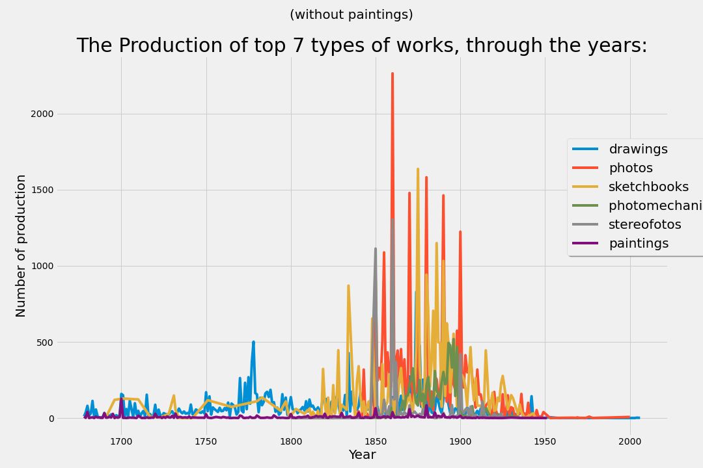

# [Rembrandt's Genius](https://indzhov.github.io/Rembrandt-s-Genius/) 
[(the code)](https://github.com/indzhov/Rembrandt-s-Genius/blob/master/Untitled.ipynb) 

This is my final project for the Data Science course, provided by SoftUni Bulgaria. It is trying to accredit the theory behind the Rembrandt's genius through the scientific way, that we were taught during the course .

This is a Digital Humanities project. This field have not a correct description. However, one of the well-known formulating is : an academic field concerned with the application of computational tools and methods to traditional humanities disciplines such as literature, history, and philosophy. In my case art history.

The following paper will be used as a Data Science project for a practical exam. The course Data Science- July 2020 is hosted by Software University, Bulgaria. 

As a source of our topic will be used the public access to Rijksmuseum’s collection. From it we will form a number of hypothesis, which have been researched. Before every main section there will be a text information like this, with full information about the researched hypothesis, the structure of the code, and at the end will be presented the outcome of the analyze. Every cell will be documented as well. The sections are as follows : 

# 1. Cleaning of the data set (half a million records) 
# 2. EDA (Explanatory Data Analysis) and Data Visualization : 
  - From the whole collection only 15 authors have more than 1000 works.
  
  - The authors with most works from the collection are : Vinkeles, Reinier; Bauer, Marius; Breitner, George Hendrik; Chodowiecki, Daniel Nikolaus; Israels, Isaac; Luyken, Jan.
  - The sketchbook sheets and pictures are the most used types among the most productive painter in the collection.
  
  - The pictures are the most common object in the whole collection.
  
  - The most common type of works in the museum have their peak in 19th century.
  - Only the production of drawing has its peak in the second half of 18th century.
  - The paintings have been produced through the centuries in the same proportion, constantly.
  
  - The pictures production has been very chaotic, its disappearing as a medium is in the begining of 20th century.
  
  
 # First Hypothesis : 
Our hypothesis will be examined after we separate every picture through 17th century(the century in which Remrandt has produced Night Watch, the painting which is exhibited centraly in the “Night Watch Room”) into a different category. The grouping in categories will be done by the numbers of works produced by a single painter through this period. Basically, we will explore the theory that a curator in a particular museum is trying to aquire or keep more paintings related or produced by a native painter. Next, from the visualization we will conclude if in the Rijkmuseum, the dutch painters though 17th century have succeded to attract the attention of the curator.
  H0.1 - Here we pay particular attention to the circle of painter, whose have a lot of works in the collection e.g the curators have particular attention to them:
  
  H0.2 - Here we are analysing them more closely:
  

(Bonus Hint : we will see that Rembrandt is among the top 3 painters, whose works are numerous in the paintings category, through 1th century.)

# 3. Creating a model 
   Here the images of the paintings will be downloaded and stored for separated folders(for training and testing the model). Our goal here is to create a model, which is based on Traditional Machine Learning algorithm and will be able to segment and classify paintings with similar features, as the well-known “Night Watch” by Rembrandt. 
# 4. Optimizing the model 
# 5. Traditional Machine Learning
  # Second Hypothesis : 
  Here with the results after the segmentation and the classifying we will have 10 paintings with the same topic on the same subject, as the Rembrandt’s Night Watch. Thus, we will be able to apply karnels to our results. The Edge Detection karnel will help us to noting the different patterns, uses and general idea of the edges in the painting by Rembrand contrasted with everyone’s else. Here the hypothesis that will be proved is if the uses of spares,flags and muskets and their positioning are chaotic and if their varying traectory is different from other 9 paintings. The question is raised, because art historians believes that this aspect is important for “Night Watch”, because it brings such a feeling of movement and action. 
  # Third Hypothesis : 
  The Box Blur karnel will help us to blur the works more. This is needed because we will form hypothesis from which if we blur the paintings once more, the secondary figures in Rembrand’s work will become almost impossible for indefitication. This is expected after the theory by art historians, who says that Rembrand’s is among the first painters, who has painted the optical focus in his paintings. Something which after a centuries will find a application in the cameras as the ‘bokeh’ effect or in the cinematography as the focus of the lenses. 
  
# Now we know, proved through the scientific way two of the main characters in the Rembrand's Genius .

